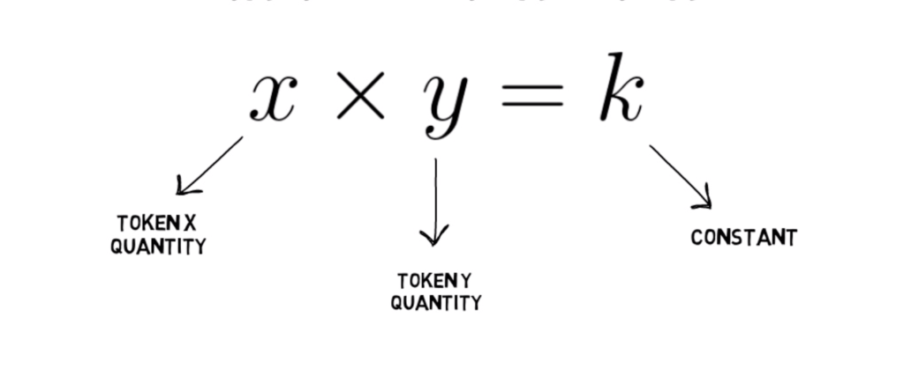

# Unipool 🦄 • [](https://github.com/abigger87/femplate/actions/workflows/tests.yml) [](https://github.com/abigger87/femplate/actions/workflows/lints.yml)   

## Features

* ✅ Removed Uniswap LP fee (1/6 of liquidity growth)
* ✅ Added swap fee customization
* ✅ Optimized pair creation (EIP-1167)
* ✅ Added permit swap methods to router

 
## Blueprint

```ml
lib
├─ ds-test — https://github.com/dapphub/ds-test
├─ solmate — https://github.com/Rari-Capital/solmate
src
├─ Unipool — Gas optimized Uniswap V2 pair contract
├─ UnipoolRouter - Gas optimized Uniswap V2 router contract
└─ UnipoolFactory - Gas optimized Uniswap V2 factory contract
```

## Deployments

```ml
Ropsten
├─ Unipool — 0x1dd1e75b2032bb5af9e4681a944e8bcb3dd64ce9
├─ UnipoolRouter - 0xB11DDDf6F32eFc7d903802631CFc06EC400AB6e8
└─ UnipoolFactory - 0x0b4EE8721cc2D777291eF918Fe05e7471c9c9dc5
```

## License

[AGPL-3.0-only](https://github.com/abigger87/unipool/blob/master/LICENSE)

## Acknowledgements

- [foundry](https://github.com/gakonst/foundry)
- [solmate](https://github.com/Rari-Capital/solmate)

## Disclaimer

_These smart contracts are being provided as is. No guarantee, representation or warranty is being made, express or implied, as to the safety or correctness of the user interface or the smart contracts. They have not been audited and as such there can be no assurance they will work as intended, and users may experience delays, failures, errors, omissions, loss of transmitted information or loss of funds. The creators are not liable for any of the foregoing. Users should proceed with caution and use at their own risk._
